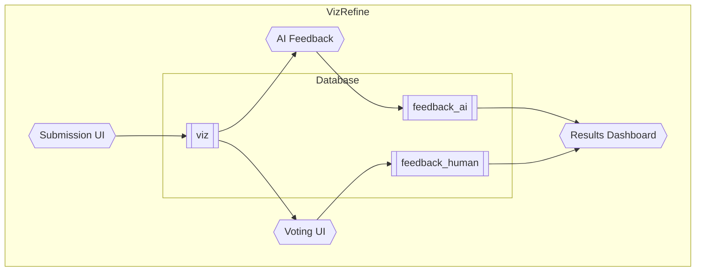

This is my first entry into the canon of "How I Use AI" blog posts. I'm choosing a narrative style, which is in line with my personal preferences for writing and hopefully makes this post more engaging than a listicle, too. And before you ask, I typed every word of this post myself. I see little value in having AI write for me when I am trying to share my personal experience in my own voice.

The hackathon project I'll be writing about is very much confidential, so for the purposes of this blog post I'm going to use an imaginary project that shares similar characteristics but has nothing to do with the actual work I'm doing for my employer. In the spirit of this post, I asked Claude to help me draft the following theoretical project based on the real project description:
## VizRefine - AI-Orchestrated Data Visualization Coach
### Problem statement
Like any data-driven corporation, many facets of our business use data visualizations like plots and graphics to communicate ideas, results, and projections. While we may use a wide range of tools to make those visualizations - PowerBI, `matplotlib`, `ggplot`, Microsoft PowerPoint - they all can be evaluated on standard bases for qualities like clarity, readability, and aesthetics. **VizRefine** is a suite of tools that allow internal users to create, evaluate, and share structured feedback to enhance data communication enterprise-wide.
### System Architecture

The system consists of a visualization submission UI that accepts an image of the visualization (required) plus optional code to generate that visualization and written context/description. These visualizations are stored in a the `viz` table of the database. An automated AI evaluator sends the visualizations to a multimodal AI model to gather feedback, stored in the `feedback_ai` database. A second UI allows users to view and provide anonymous feedback, stored in the `feedback_human` table. Finally, a results dashboard displays aggregate results to measure engagement and usage.
***
## 8 days before the hackathon
I happened to get access to Claude Pro (and Code) at work around the same time I confirmed my team for the hackathon. This meant that I got to play with some features that I'd previously only used for personal projects (and to a relatively limited extent). The first thing I did was create a new [Project](https://www.anthropic.com/news/projects) where I could keep all my VizRefine-related chats in one place.

My first conversation in the new project was research-related: I asked Claude to identify all relevant best practices related to data visualization assessment, as well as gather those results into a comprehensive report using the [Research](https://support.claude.com/en/articles/11088861-using-research-on-claude) feature. To be honest, the results were not great. I have since learned that Research isn't always helpful if you give it too broad of an ask. Even though it refined the question before beginning, the final report read more like a collection of short synopses than an actual integrated review.

I have had better success by including the structure of the report I'm expecting in my prompt, which seems to help guide it to focus on the right things first. If I could do it again, I would use a prompt like:

>Do an initial literature and code search for frameworks for evaluating data visualization quality in a holistic way. Consider both human-driven benchmarks and rubrics as well as automated scoring systems. When you have sufficiently covered the benchmarks and rubrics themselves, investigate AI-driven methods for programmatically evaluating data visualizations and providing feedback. Your report should be written like a literature review with discussion and references in each section.

My next step was preparing for a short pre-hackathon meeting with the team. Our team was drawn from several different departments, so I wanted to make sure we all got a chance to meet each other and share our skill sets before the two-day sprint of the event itself. Having never led a team like this, I asked Claude for some advice:

>I'm on a hackathon team for an internal hackathon and would like some help thinking about team organization/roles/charter. The participants are:
>(List of participants removed for confidentiality - but for each I included their name and a sentence about their subject knowledge and tech stack)
>We're going to have a prep meeting tomorrow to talk about roles and ideas; what kinds of things should we decide and document?

Since I ran this query within the Project where I'd already had some research back-and-forth, Claude was able to respond both generally and with some specific sense of what we were planning to work on, without me having to write a long-winded explanation! Claude came back with some proposed "roles" for each team member, recommended we focus on discussing scope of the project and technical stack at a high level so that those conversations didn't slow our momentum when the hackathon started, and then reminded me that we should probably talk about reasonable expectations for work hours and communication. I asked a few short follow-up questions, then proceeded with a personal ask:
>What is my role as team leader?

I wish I could share the exact transcript without getting tangled in my company's confidentiality rules, because the answer was really helpful. Claude knew enough about the project and team by now to remind me that even though my normal role at work is as an "individual contributor," for these two days I needed to remind myself that the goal was team success, not my individual contribution, and "let" myself do less of the actual coding if my time was needed helping unblock other parts of the project. It tied this up nicely by suggesting that indicators of success as a team leader would look like a successful demo, team members feeling like their expertise and time was used effectively, a presentation that clearly articulates the value and innovation, and a desire from the team to continue working together. 

The prep meeting went well, and after downloading the meeting transcript to add to the Project files for good measure, we were ready to go.

## The night before the hackathon
With a small amount of prep work behind us - you can't do too much setup without starting to stretch the philosophy of a true hackathon project - our team was ready to go, but I was still pretty nervous. Though I'm generally highly skeptical of using AI for advice, this seemed like a reasonable situation to try Claude's more social-emotional problem solving capabilities.

>The hackathon is tomorrow and I'm a little nervous. This will be my first time "managing" a team like this. What advice do you have?

The response was a bit formulaic, with that classic five-point list followed with one "Remember:" statement that just screams "I WAS WRITTEN BY AI."

Here are the headers of those five sections, and what I think about them

1. "Set expectations early": Smash. Basically just making the point that we shouldn't dive right in, we should take a second to regroup and review the plan.
2. "Lean into your team's strengths": Pass. Logically contradictory advice (compared to the previous chat) that I should let everyone go off and do their thing, even though I know I'll actually need to be playing a more involved role at first to clear technical blockers (i.e. access to the right databases and such).
3. "Timebox ruthlessly": Pass. This isn't a startup, nothing we do needs to be "ruthless."
4. "Stay one step ahead": Smash. This one was actually a good point about how as team leader I should be focusing on queueing up the next work while individuals on the team are getting the current tasks done.
5. "Delegate the easy wins": Smash. It basically told me to not think about the UIs too much but instead start [Claude Code](https://www.claude.com/product/claude-code) in the background while I worked on the parts that needed more thought and communication, like database schema setup.
6. "Remember: Innovation judging rewards the story": Pass. Just sloppy nothing-burgers about how to do a good product demo.
Honestly, this was a little helpful, if only because the comical degree to which Claude was "taking this too seriously" reminded me how low stakes, high upside this event is. I slept pretty well that night.
## Day 1
Things kicked off with a bang, and while most of the first day's work didn't really involve AI tools, I took Claude's advice and had a background terminal or two running Code instances to get the ball rolling on some of the orchestration frameworks. Other team members had asked to work on the UIs, which would be the area I would expect Code to get the most done autonomously, but it was a good way for me to assess how well it can handle [complicated deployment processes](https://docs.databricks.com/aws/en/dev-tools/bundles/) by fetching documentation. It was modestly helpful in that it set up some boilerplate that exposed a permissions issue sooner than I would have found it on my own, but otherwise probably not that much of a net efficiency gain.

By the end of the day we had the main database for storing visualizations set up, most of the code sorted out for the automated AI evaluation, and prototypes of the visualization submission and voting UIs.

## Day 2
The focus on Day 2 was getting to MVP. A lot of that was just talking through things that needed to get tied together - for instance, we had initially prototyped the voting UI on a schema that later evolved, so we had to go back and do a bit of schema alignment to get everything onto a shared database. This is the kind of work that is still easier to do with another human. For instance, I explained what was in my proposed schema. An AI would have said "great, I'll update the schemas to merge with your new proposal..." A human said "Wait but that might not work the way we need it to yet - what if we did this instead?" Now of course, you could probably get that kind of response by asking the model to second guess your work, but when's the last time you actively asked someone to second guess your work?

Towards the end of the day, things were hooked up enough that we could actually start testing things all together. Here, finally, is where Claude Code started to really shine. Code is far more fluent in [Streamlit](https://streamlit.io/) than I could ever be, and can resolve requests like:

>"Switch the view from dropdowns to multiselect"
>"Make the dashboard plot larger, using \[a specific color scheme\]"
>"We want to view this metadata formatted nicely next to the visualization being graded in a collapsible box"

faster than I could address them myself.

This was one of my more interesting observations from the project: while lots of hype around "vibe coding" tools is focused on being able to build things from scratch with limited oversight, I'm finding them far more reliable and useful for iterative improvement. I could spend an hour "supervising" Claude code building a UI from scratch, or I could just throw the basics together in thirty minutes and spend ten minutes getting Claude code to add the final touches. (I'll still use autocomplete and other semi-agentic features to make that prototype, just not full-on vibe coding.) That approach actually gets you to working prototype faster, which means you get more iterations, which means you either get to the final product sooner or get to a higher quality product by the end of the day.

The last two hours of the day I primarily worked on making the presentation. Again, this is a place where AI is not super helpful, yet. I do not have access to the Copilot features for PowerPoint, so I was stuck doing old fashioned drag and drop and writing words myself. When things were nearly complete, however, I exported to PNG, uploaded to Claude, and asked it to tell me what was missing or what could be said more cleanly. This was slightly helpful - it cleared some redundancies in slide text and helped me write a more compelling summary slide. I wouldn't say the quality of the feedback was better than I would have gotten from an average coworker, but at 4:30pm on a Friday after nearly 16 working hours of coding? You better believe it was better than anyone on the team could muster.

## Presentation Day
The actual presentation went really well, and AI had no role in it. Afterwards, knowing that I was unlikely to get meaningful feedback from anyone, I dumped the transcript into Claude and asked for a review.

My first attempt was useless. There were so many timestamps in the transcript that Claude didn't actually read the full content - though it claimed it had - and provided a response that clearly indicated only the first few minutes and last few minutes of content had made it into the LLM's context. After uncovering this with a few follow-up questions, I had Claude write me a Python script to strip the timestamps and consolidate active speaker information in a more compact format.

A five minute detour to VS Code later, we were back at it. This time, I got a helpful summary. It was particularly notable to me that it zeroed in not on my presentation, but on the judges' responses and follow up questions, to assess how compelling our pitch was. I didn't necessarily expect that level of analysis. It also made a key point that I agree with: we could have used one standout, end-to-end example of a bad visualization that got a useful AI-generated coaching response, that aligned with a human review, that was used to make a better visualization, that got a better score. We (humans) actually discussed doing this at one point, but it slipped through the cracks and didn't make it into the final presentation.

Oh, and at the end of the day, we won the coveted "most out of the box" award :)

## So, like, is Claude my coworker now?
The question hanging over me as I wrote this whole reflection was: did Claude actually make this project any more successful? Was Claude the "[sixth man](https://en.wikipedia.org/wiki/Sixth_man)" to our starting lineup?

Knowing that Claude would be able to help me make quick final touches to code freed me up to be more creative. It meant that I could "afford" to spend an extra five minutes talking through different ideas with my teammates before we had to get hands-on-keyboard. It also helped us "cheat" a little by front-loading research tasks that none of us had time to do prior to the hackathon. And in that planning phase, when I was trying to wrap my head around what it means to lead a successful team, it was helpful to have "someone" to bounce ideas off of, other than my partner or my very-busy human manager.

Final verdict? Yes, I think having access to Claude made it easier for me, and our team, to get this project to the finish line. Do I think we could have gotten there without it? Absolutely, but it would have been more stressful for me personally, and more down-to-the-wire for the team overall.

Modest gains on the way to the singularity.