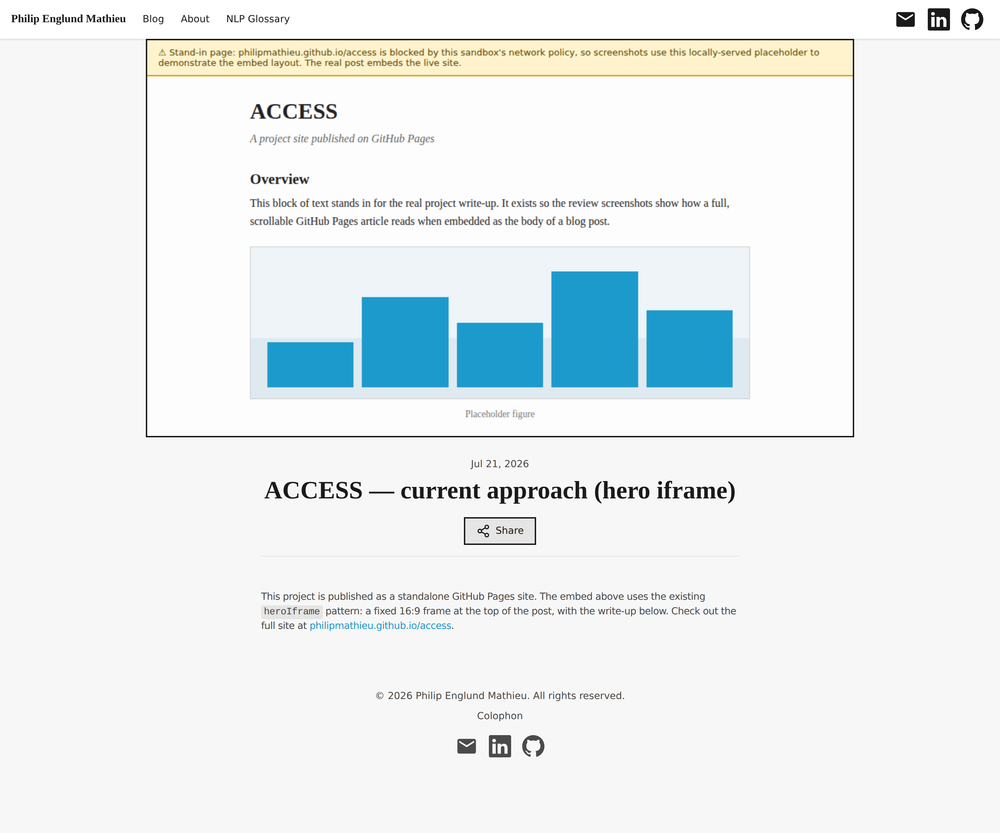
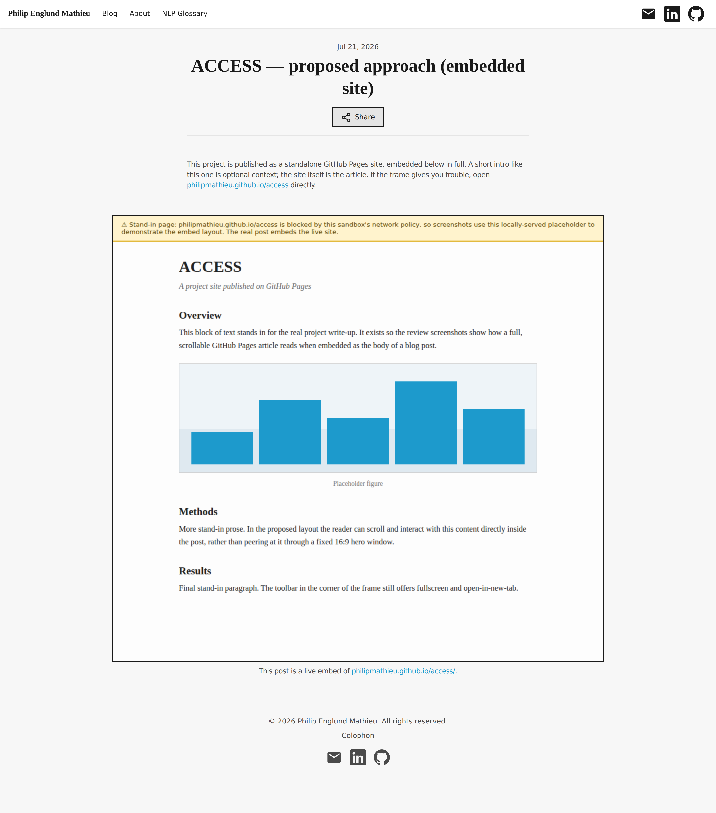
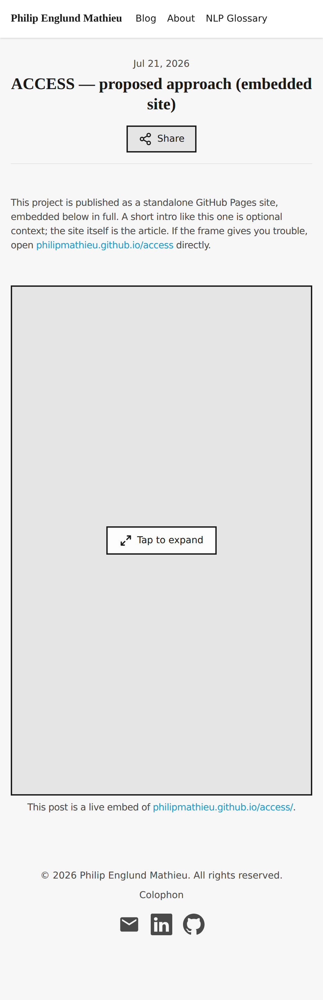

# Head-to-head: heroIframe vs embedSite for GitHub Pages posts

*2026-07-21T00:58:40Z by Showboat 0.6.1*
<!-- showboat-id: 5b6b0312-1af5-4e82-9696-74da3bf87548 -->

This walkthrough compares the two ways PR #40 can present a GitHub Pages site (`philipmathieu.github.io/access`) as a blog post: the **current** `heroIframe` pattern (16:9 frame above the title) and the **proposed** `embedSite` pattern (the site rendered as the post body).

> **Screenshot caveat:** this sandbox's network policy blocks `philipmathieu.github.io`, so the frames in the screenshots below show a locally-served stand-in page (labeled with a yellow banner). The layout around the frame is the real built site; only the frame's contents are substituted.

```bash
grep -n 'embedSite\|embedHeight' astro-site/src/content.config.ts
```

```output
20:			embedSite: z.string().url().optional(),
21:			embedHeight: z.string().optional(), // CSS height override for the embedSite frame
```

```bash
head -8 astro-site/src/content/blog/access-hero-iframe.mdx
```

```output
---
title: 'ACCESS — current approach (hero iframe)'
description: 'Demo post: embedding the ACCESS GitHub Pages site with the existing heroIframe pattern.'
pubDate: 'Jul 21, 2026'
heroIframe: 'https://philipmathieu.github.io/access/'
draft: true
---

```

```bash
head -8 astro-site/src/content/blog/access-embedded-site.mdx
```

```output
---
title: 'ACCESS — proposed approach (embedded site)'
description: 'Demo post: rendering the ACCESS GitHub Pages site as the body of the post via the new embedSite frontmatter.'
pubDate: 'Jul 21, 2026'
embedSite: 'https://philipmathieu.github.io/access/'
draft: true
---

```

```bash
grep -o 'iframe-embed not-prose" style="[^"]*"' astro-site/dist/blog/access-hero-iframe/index.html astro-site/dist/blog/access-embedded-site/index.html
```

```output
astro-site/dist/blog/access-hero-iframe/index.html:iframe-embed not-prose" style="aspect-ratio: 16/9;"
astro-site/dist/blog/access-embedded-site/index.html:iframe-embed not-prose" style="height: min(calc(100dvh - 9rem), 900px);"
```

The exec above shows the built output: the current pattern sizes the frame by `aspect-ratio: 16/9`, the proposed pattern by `height: min(calc(100dvh - 9rem), 900px)`.

## Current: `heroIframe` (16:9 letterbox above the title)



The document-shaped site is cropped to a 16:9 window before the reader even sees the title — fine for a map or dashboard, awkward for an article.

## Proposed: `embedSite` (site as the post body)



Title and short intro first, then a full-container-width, near-viewport-height frame the reader can scroll like the article it is, with a plain fallback link below (SEO / no-JS). The IframeEmbed toolbar (fullscreen, open-in-new-tab) is unchanged.

## Mobile



On mobile the component's existing tap-to-expand fullscreen cover takes over; setting `heroImage` on the post gives the cover a thumbnail. (The current pattern's mobile screenshot is [also in the branch](./current-hero-iframe-narrow.png).)

---
Built with [showboat](https://github.com/simonw/showboat); `showboat verify` passes (exec blocks re-run against the branch after a local `npm run build` with the demo drafts enabled).
